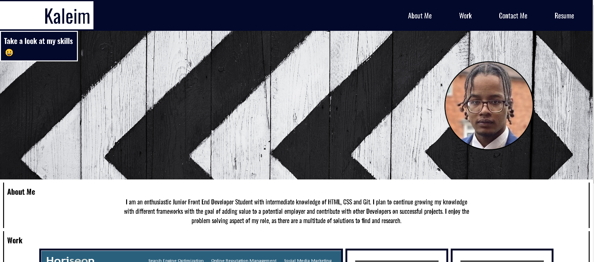
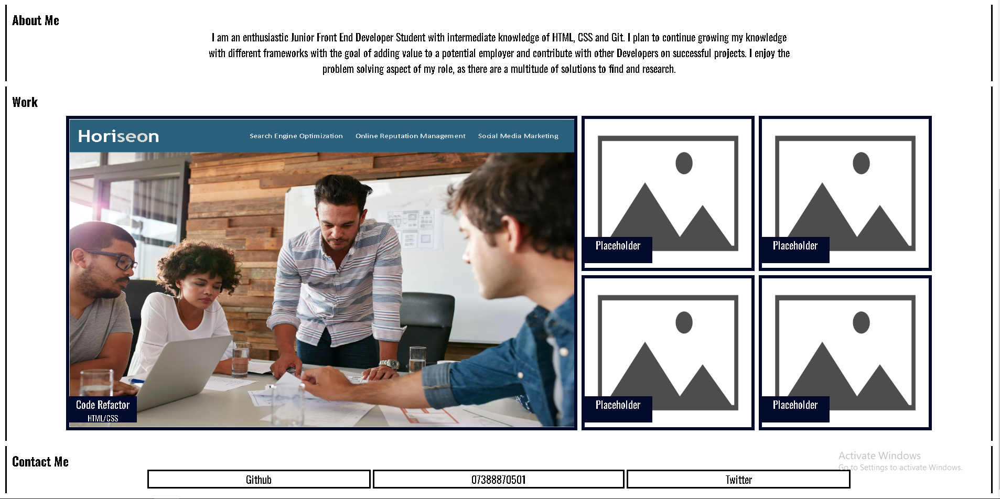
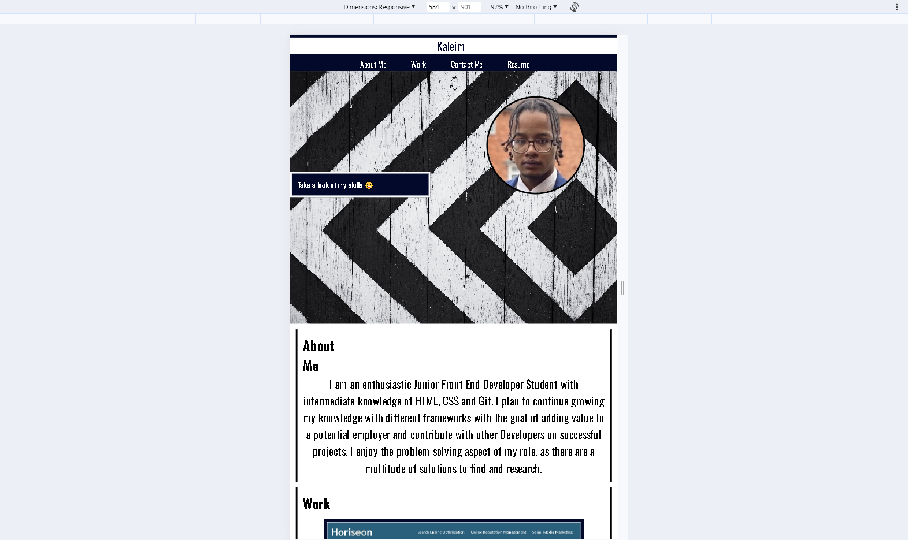
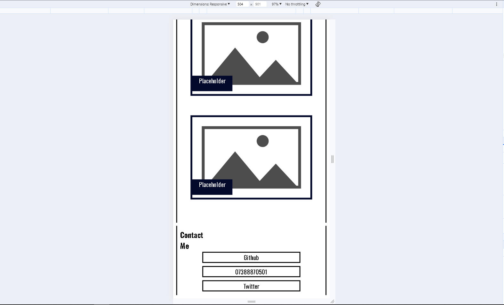

# Kaleim Portfolio

## Link to Portfolio

https://kaleims.github.io/Kaleim-Portfolio/ 

## Description
- My aim for this project was to create a responsive Portfolio to satisfy the needs of people who may be viewing my Portfolio on a mobile or tablet, not just desktop size.
  While creating this project I used the power of google to help me with media queries and css grid, it definitely helped gain further knowledge on those topics. This project was a my first responsive webpage, and was a chance to push myself to see what I could do with what I understand of CSS and HTML, I'm ready to see the improvement in my next project :satisfied:.
   
## Usage

Portfolio link is at the top of the this readme but I'll put it here just incase.

https://kaleims.github.io/Kaleim-Portfolio/ 

To test the responsiveness, right click anywhere on my Kaleim-Porfolio Webpage and click inspect. At the top right of the page to the left of the elements tab you will see a small logo that looks like a labtop and mobile, hover over it and it should say "toggle device toolbar" click that. After if you take a look at the last two images on this readme, at the top theres something that says "Dimensions: responsive" click that and you will see a dropdown of different mobile devices to resize the page and see if it is responsive or not :smiley:.

&nbsp;&nbsp;&nbsp;

&nbsp;&nbsp;&nbsp;

&nbsp;&nbsp;&nbsp;

&nbsp;&nbsp;&nbsp;

## License

MIT Licence
